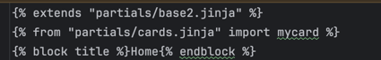
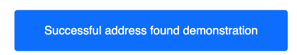
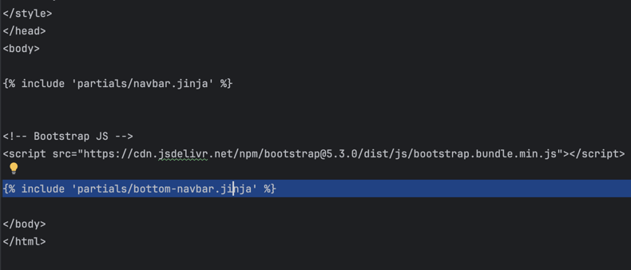
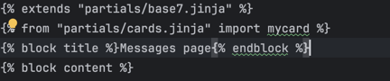
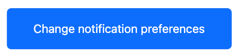

# Pet adoption app- About care

## Who are we page

### Navbar:

Created the navbar using the help of the week 11 workshop and using 
the dependency of Jinja to create templates for pages.
I created a jinja partial called navbar and then I added that 
partial to another partial called base using the jinja include feature:

I then used the base partial to output the navbar on every page so it could connect all the pages 
in my app.

With the navbar function, by pressing the home page, it would bring the user 
to the base page. Alternatively, the user pressed on  the who are we button, 
it would bring them to the who are we page.

### Partials:

I created a partial called base to store all the css for the first page as well as the navbar.
This allowed me to reuse the css style of the page for other pages allowing 
me to create pages faster without having them to rewrite them from the start.
Furthermore, the .image-text-row styling ensures that the image and text on
this page were alligned horizontally instead of vertically.

### Back to login button:

When pressed this would allow me to go the next page which was the base page.
The fixed-bottom class allowed the button to move with the screen so as the user 
scrolls  it would still be fixed to the bottom of their screen.

## Base page

As you can see for the base page, I created a new partial called base 2 as the
layout for this next page differed quite a bit from the first page, especially 
with the positioning of images. Therefore, I created a new partial so that the 
css style of different pages wouldin't clash with each other. Furthermore, lets 
say I was using the first partial for this second page, and started to change the css style of the base partial this would also change the format of my first page so it would be easier creating a new base partial. 

In my partial called base 2 I added this line of code allowing me to use the partial I 
created called navbar and add the code for the navbar to this base page without having to 
rewrite the code from scratch.

The login to the applicaiton button brings the user to the login page.

## Login page

Again I used a different partial for the login html page as it didn't have a similar format
to the other two previous pages.

### Forms:

To create the inputs for the email and password I used a bootstrap component called forms which
already gave me the code for creating this function saving me time.

To create the forgot password link I used another boostrap component called links allowing me to 
create a forgot password link which could redirect a user to another page to find their password.

Pops up with a message if the user has entered nothing into the email input.

## Create account page

Since the format for the create account page was similar to the login page, I used the same partial 
for this html page which was base 3 saving me a lot of time.

The enter manually button brings the user to the address page.

## Address page

Once again the format for the address page was similar to the last two previous pages so I reused the partial
of base 3. After using it for a third time I started to see how much time the use of partials acutally saved me 
as there was a lot of code I no longer needed to rewrite.

### Forms required:

As you can see on this page, some of the form inputs have a red star next to the title and some don't as with this form
there's certain information that requires an input from the user whereas some inputs such as the second line of address
are optional for the user.

To add the red start to the title of the input I added a required to the end of the input code making that input type a
required one.

After pressing the successful address found demonstration button the user will be brought back to the create account page 
to confirm the creation of their account

Afterwards the user would press the create account button to be brought to the E-mail verification page.

### Email verification page

Once again I used the partial of base 3 as the format for this page was the same as the previous page. Once the user presses
the confirm verification button they are brought to the 

The confirm verification button brings the user to the Main feed page.

## Main feed page

As this page was had a totally different layout to all the other previous pages
I decided to create a new partial called base 5:

The reasoning for this not being called base 4 is that I accidentally thought I had
already created a base 4 so I ended up skipping creating a partial called base 4
and just used the base 5 partial instead as by the time I realised it, I was already
progressed quite far into my code.

### Search input and search bar:

I used the dependency of bootstrap, specifically the form component to create the search bar
with the placeholder of search pets. Then I created a button to allow the user to search. Then
the form class = D-flex function was added to my base 5 partial and ensures the input and button 
appear side by side.

Example input.

Filters and favourites button created to bring the user to the filters and favourtie pages.

### Using jinja and json file to create alternating pet images and text positions

Firstly, I created a json file called test and I added the data I needed for each pet on the main 
feed page. In this json file I created a table which held the data of the image source, alternate text
name, location, description and page for each pet. 

For the main feed page I needed the pet name, pet image, the shelter location and the shelter description.

I then researched more about jinja and how to use conditional loops using this link:
https://ttl255.com/jinja2-tutorial-part-2-loops-and-conditionals/

I then created a for loop that would loop through the json file to output the details of each pet to my main feed
page. Since I needed to alternate the position of the pet image and text, I created a counter. If the counter was 
even then the position of the pet image and pet content would reverse. If the counter was odd, then the position of 
the pet image and text would stay the same.

With each loop I added the find out more link allowing the user to be brought to another page containing more information
on the pet they are intrested in.

Made the images circular by using the bootstrap component borders and using the class = "rounded-circle function".

### The bottom navbar

Once again I used jinja, to create this bottom navbar by firstly creating a partial called bottom-navbar.

Added the code for the bottom navbar to this partial. The justify-content-around function ensures the iamges
are alligned horizontally side by side. Furthermore, the bg-light makes the footer have a lighter background for 
visibility. Then border top adds a border to the top of the bottom navbar, allowing to me seperated from the rest
of the page.

I included the bottom-navbar partial to my base 5 partial. As you can see both the navbar and bottom-navbar partials
are included in the base 5 partial, once again saving me time as I don't have to rewrite code from scratch.

## Filters page

For the filters page I reused the base 3 partial, as it had a similar layout.

### Borders:

Created a borderline using the border component in boostrap allowing me to split 
the filters page into different sections.

### Search bar and add button:

I used the same code from my search input and search button from the main feeds page and 
changed the search button to an add button. 

### Remove pets:

Used lists in html to output the text and buttons for each pet type.

### Age and distance from shelter ranges:

Used the range form component in bootsrap to create the range inputs
for age and distance.

Changed the max for both the age and distance input to 100 allowing the user
have a more varied range to choose from.

### buttons:

All these buttons bring the user back to the main feed page.

## Expanded details page

This page gives the user more information on the pets on the main feed
page. 

I reused the same partial of base 5 as this page had a similar layout to 
that partial.

Used the same code for the pet image and text from the index page but instead of
having it allgined horizontally I changed it so it alligned vertically.

Used a list to list out all the details and extra information on buddy.

### Contact shelter and favourites buttons:

The contact shelter button brings to you the messages page and the add to favourites
button brings you to the favourties page.

## Favourites page

This page shows all the pets that you've favourited from the main feeds page.

I created a new partial called base 6 for this page.

Once again I reused the code from my index page where the text and image were alligned 
horizontally and all I did was change the image and text.

Used a function called btn-group to group the see them again button and remove button side
by side. 

## Messages page

The messages page allows the user to contact shelters about pets or other enquiries.

Created a new partial called base 7 for this page.

### Messages button:

 Used the bootstrap component Icon to find a messages icon and then added the text messages after
the icon to create a messages button with a messages icon. When this button is presesed it brings 
the user to the extended messages page.

### Remove conversations button:

Used btn-danger from the bootstrap icons function to add the red color to the remove button.

## Extended messages page

On this page the user can text the pet shelter, send them attachements or even video call them.

Created a new partial called base 8 for this page.

### Start video call button:

When the user presses this button it will bring them to the video call page. Furthermore, I used
btn-success to make the color of this button green.

### Messages navbar:

I used bootstrap icons get the icons for the add attachements button as well as the sends message button.
Once again I used form class= D flex to allign these three items horizontally and have them centered.

## Video call page

Used the same base page as this page had the same format at the extended messages page.

### End video call button:

When the user presses this button it brings back the user to the extended messages page.

### Icons

 
Used boostrap Icons for all the icons on the bottom of the video call page.

All alligned horizontally and centered using the fixed-icons-container function.

## News page

The news page informs the user of the latest news regarding adopted pets and showing
rescue stories.

Created a new partial called base 9 for this page.

### Carousel:

To create the carousel function for the news page, I used the carousel component from 
bootstrap. Since, I had multiple photos and text, to save time and code I decided to
create a similar function to my main feed page, where I would call the images and text 
from a json file and use a jinja loop to call each image and text. 

### News json file:

Firstly I created a new json file called news.json:

This json file would hold two sets of texts and two sets of images. The first set of text 
and image would be related to stories and the latest news as show at the top of the news page.
The second set of image and text would contain the updates for the current news. 

### Jinja loop:

Afterwards I created a loop with jinja to output the data from the news.json file and I inputted
the carousel function into that loop so it would output different sets of data with each slide 
from the carousel. As a resulted this created a carousel with slides containing two sets of images 
and text.

### Subscribe to our newsletter counter:

Once again, I created a button group to allign these two buttons together. This counter shows the user
how many subscriptions they have to the newsletter.

When the user clicks on the account button with the use of the bottom navbar, they will be brought to the 
accounts page.

## Accounts page

The accounts page is used for altering parts of the user's account.

The log out button brings the user back to the base page allowing the user to log in to a new account.

The accessibility button brings the user to the accessibility page.

The change notification preferences button brings the user to the notifications page.

Like the log out button, the delete account button brings the user back to the base page to either log in to a 
new account or create a new account.

To create all these buttons I put them into one container and ensures their layout was the same for all.

## The notifications page

Many of the functions for this page, I had already created in previous pages so this page was quite easy and 
quick to make as I reused much of my previous code when creating it.

For this page, I decided to reuse the base 3 partial instead as the layout of this page was very similar to the pages 
which used the base 3 partial.

### Button groups

Copying the code from my subscribe to our newsletter button group, I was able to easily create three new sets
of buttons, giving the user push notifications, custom push notifications as well as an add function allowing 
user to add pets to their alerts.

### Remove pet notifications

Once again, I reused code to create the remove pet notifications as I had the same feature on the filters page 
I previously created with the pet remove function. All I had to change for this function was the text.

The done button brings the user back to the accounts page.

## Accessiblities page

Once again, I reused the base 3 partial for the accessibility page.

### Drop down button group

For the theme change function I reused the button group function that I used from
my previous pages. However, I replaced the code for the left button with the drop down
component from bootstrap. As you can see when I press the drop down button, it shows me 
options of differemnt themes.

I did the exact same thing for the font function allowing the user to choose from different
functions.

### Text size range function

I reused the code from my filter page which already used these range components from bootstrap.

I reused the code from my subscribe to newsletter button group on my news page to create this text to speech
reader button group.

The done button brings the user back to the accounts page.

